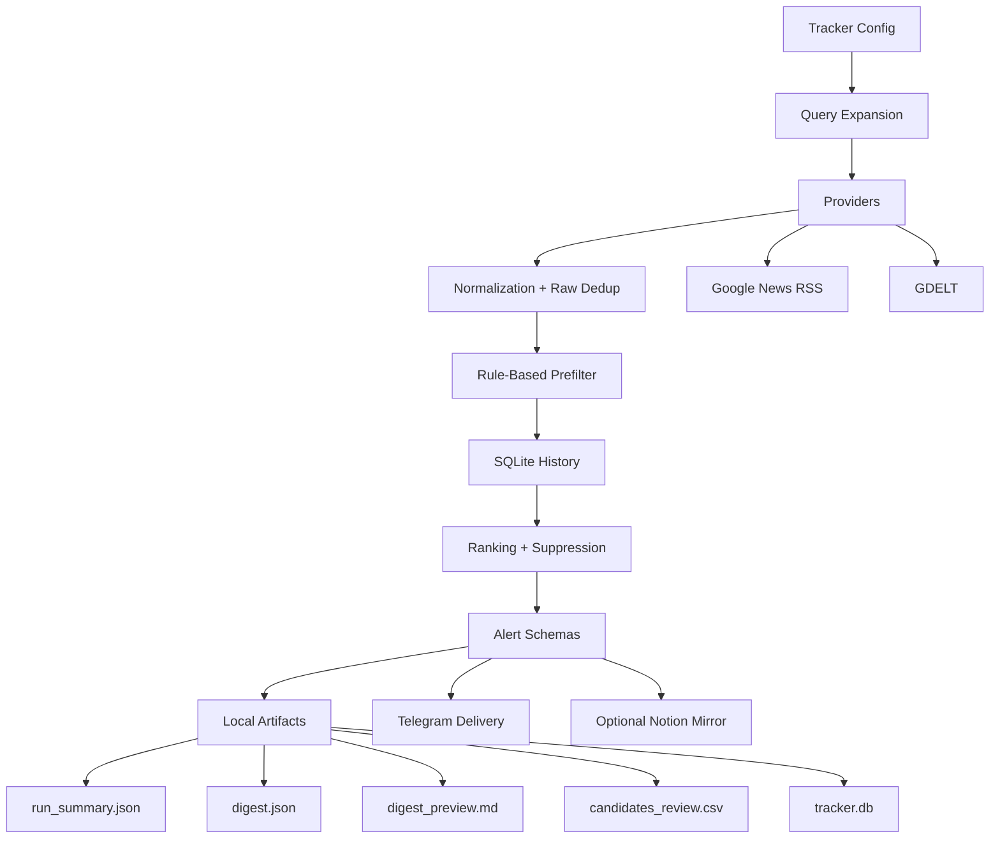

# Competitor Tracker Architecture

## Product Positioning

This repository currently contains two product branches:

- `competitor_tracker` — the new MVP for daily competitor monitoring
- `indrive_media` — the legacy pipeline that remains in the repository for continuity

This document describes the new `competitor_tracker` architecture first. The legacy pipeline is summarized briefly at the end.

## MVP Goal

Build a low-cost daily competitor digest that:

- tracks configured competitors across selected regions
- focuses on market moves, launches, partnerships, promo/pricing, and related strategic signals
- suppresses duplicates and already-sent alerts
- delivers a compact operational digest instead of a firehose
- keeps local state in `SQLite`
- optionally mirrors final alerts into `Notion`

## Design Principles

### SQLite as source of truth

`SQLite` is the operational backbone of the MVP. It stores:

- raw articles
- scored candidates
- final alerts
- run summaries
- delivery history

This keeps the tracker usable even when external integrations are unavailable.

### Cheap signals before expensive enrichment

The tracker first applies normalization, deduplication, topic detection, region detection, and scoring. This lowers the number of signals that would ever need richer enrichment.

### Config-driven monitoring

Regions, competitors, topic groups, query templates, provider list, and digest limits come from config, not hardcoded flows.

### Digest-first delivery

The system is designed to decide “what is worth showing today”, not just “what was found”.

### Managed carry-over

The Telegram path is not a blind retry queue. The tracker keeps a bounded carry-over model:

- alerts sent to Telegram become `delivered`
- relevant alerts that miss the Telegram top slice become `deferred`
- deferred alerts can re-enter ranking on the next Telegram run
- deferred alerts expire after `48 hours`
- stale carry-over alerts get a slight ranking penalty versus equally strong fresh alerts

## System Components

## Main Modules

### Configuration

- [src/competitor_tracker/config.py](/C:/Users/shar0/Desktop/indrive_feedback/src/competitor_tracker/config.py)
- [default_config.json](/C:/Users/shar0/Desktop/indrive_feedback/src/competitor_tracker/default_config.json)

Responsibilities:

- load and validate config
- define regions and competitors
- define topic groups and keyword templates
- expand search queries for providers
- keep runtime settings separate from domain config

Default monitoring themes currently encoded in config:

- `market_expansion`
- `campaign_launches`
- `pricing_promo`
- `industry_context`
- `strategic_operations`
- `performance_growth`
- `product_features_innovation`

### Providers

- [src/competitor_tracker/providers.py](/C:/Users/shar0/Desktop/indrive_feedback/src/competitor_tracker/providers.py)

Responsibilities:

- fetch low-cost public articles
- normalize provider payloads into `RawArticle`
- isolate provider-specific request logic

Current providers:

- `Google News RSS`
- `GDELT`

### Normalization and Deduplication

- [src/competitor_tracker/normalization.py](/C:/Users/shar0/Desktop/indrive_feedback/src/competitor_tracker/normalization.py)

Responsibilities:

- normalize URLs, titles, dates, and source labels
- deduplicate raw hits across providers
- keep new tracker logic independent from legacy `indrive_media`

### Analysis

- [src/competitor_tracker/analyzer.py](/C:/Users/shar0/Desktop/indrive_feedback/src/competitor_tracker/analyzer.py)

Responsibilities:

- rule-based prefilter before any optional LLM usage
- detect:
  - competitor
  - topic group
  - region
  - country hint
  - language hint
- assign baseline score and reasons
- produce alert-ready schema for readable delivery

### Ranking and Suppression

- [src/competitor_tracker/digest.py](/C:/Users/shar0/Desktop/indrive_feedback/src/competitor_tracker/digest.py)

Responsibilities:

- rank by:
  - priority
  - freshness
  - deferred penalty
  - confidence
  - score
- suppress duplicates within one run
- suppress alerts already sent in previous runs
- suppress near-duplicate alerts from recent history
- apply top-N digest limit
- re-introduce fresh `deferred` Telegram alerts for the next run without keeping them forever

### Storage

- [src/competitor_tracker/storage.py](/C:/Users/shar0/Desktop/indrive_feedback/src/competitor_tracker/storage.py)

Responsibilities:

- persist local JSON / CSV / Markdown artifacts
- maintain `SQLite` operational history

Current `SQLite` tables:

- `articles_raw`
- `article_candidates`
- `alerts`
- `runs`
- `delivery_log`

Delivery log statuses now have operational meaning:

- `delivered` — successfully sent to Telegram
- `deferred` — relevant but did not fit into the current Telegram top slice
- `expired` — deferred too long and no longer retried
- `dry_run` — previewed without a real delivery attempt

### Delivery and Mirror Layers

- [src/competitor_tracker/telegram_sender.py](/C:/Users/shar0/Desktop/indrive_feedback/src/competitor_tracker/telegram_sender.py)
- [src/competitor_tracker/notion_sync.py](/C:/Users/shar0/Desktop/indrive_feedback/src/competitor_tracker/notion_sync.py)
- [src/competitor_tracker/formatter.py](/C:/Users/shar0/Desktop/indrive_feedback/src/competitor_tracker/formatter.py)

Responsibilities:

- format readable alerts and daily digests
- send to Telegram with dry-run and delivery logging
- mirror final alerts to Notion when configured

Important boundary:

- `Telegram` is the main delivery layer
- `Notion` is a showcase/archive mirror
- neither replaces `SQLite` as the operational state store

## Data Flow

### 1. Query Expansion

The tracker uses config-defined:

- regions
- competitors by region
- topic groups
- keyword templates

These become provider queries.

### 2. Collection

Providers fetch raw public articles and map them into `RawArticle`.

### 3. Normalization

Raw articles are normalized and deduplicated before scoring.

### 4. Prefilter

The rule-based analyzer converts valid raw articles into `CandidateArticle` objects and drops weak or irrelevant items early.

### 5. History-Aware Digesting

Candidates become alerts, then the digest builder:

- ranks them
- compares against history
- suppresses repeats
- trims the result to a daily cap
- optionally merges the Telegram `deferred` pool back into the next ranking pass

### 6. Artifacts and Delivery

The run produces:

- `run_summary.json`
- `candidates.json`
- `digest.json`
- `digest_preview.md`
- optional `candidates_review.csv`
- `tracker.db`

And optionally:

- sends digest to Telegram
- mirrors alerts to Notion

Telegram-specific carry-over only applies to the delivery path. Local-only runs still produce artifacts and history, but they do not keep building an endless retry queue.

## Low-Cost Daily Digest Strategy

The MVP is intentionally optimized for low-cost daily operation:

- no paid ingestion dependency is required to get started
- most filtering happens before any richer analysis step
- `SQLite` keeps history local and cheap
- digest cap prevents operational overload
- deferred carry-over prevents relevant alerts from disappearing while still avoiding a Telegram firehose
- markdown and CSV artifacts make manual QA simple during live trial periods

## Reliability Strategy

The new branch is protected by:

- unit tests for key modules
- integration-style tests for:
  - full dry-run with mocked providers
  - duplicate suppression across runs
  - already-sent suppression
  - digest cap behavior
  - provider partial failure
  - optional Notion behavior

This makes the refactor safer while the product branch is still evolving.

## Automation Path

The competitor tracker has its own GitHub Actions workflow:

- [competitor-tracker.yml](/C:/Users/shar0/Desktop/indrive_feedback/.github/workflows/competitor-tracker.yml)

It supports:

- scheduled daily execution
- manual dispatch
- dry-run mode
- artifact upload

The original CI workflow remains separate.

## Legacy Pipeline

The legacy branch is still present in:

- [src/indrive_media/](/C:/Users/shar0/Desktop/indrive_feedback/src/indrive_media)

Its responsibilities are different:

- inDrive mention monitoring
- legacy export/reporting flow
- separate CLI and legacy integration path

It should not be treated as the architecture of the new competitor tracker MVP.
