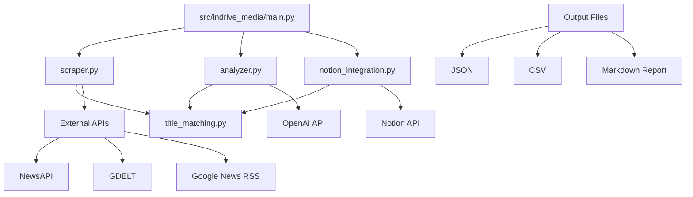

# Architecture Overview

## Product Split

- `Legacy pipeline`: текущий `indrive_media` flow в этом репозитории. Он покрывает сбор, дедупликацию, scoring, optional LLM enrichment и экспорт.
- `New competitor tracker`: новая ветка продукта, которую стоит развивать рядом, не меняя существующее поведение legacy pipeline до отдельного этапа рефакторинга.

На текущем этапе все диаграммы и компоненты ниже описывают именно legacy pipeline и действующий CLI-контур.

## System Components

## Data Flow

1. **Scraping Phase**: `scraper.py` collects news from multiple APIs with deduplication
2. **Analysis Phase**: `analyzer.py` applies heuristic and LLM analysis to filter relevant mentions
3. **Integration Phase**: `notion_integration.py` exports results to Notion database with deduplication
4. **Output**: Multiple formats (JSON, CSV, Markdown) for different use cases

## Key Design Decisions

- **Modular Architecture**: Separate concerns for scraping, analysis, and integration
- **Centralized Deduplication**: `title_matching.py` provides consistent duplicate detection
- **Retry & Rate Limiting**: Tenacity decorators and time.sleep for API reliability
- **Public APIs**: Clean interfaces between modules (no private method calls)
- **Modern Packaging**: pyproject.toml with setuptools for distribution
