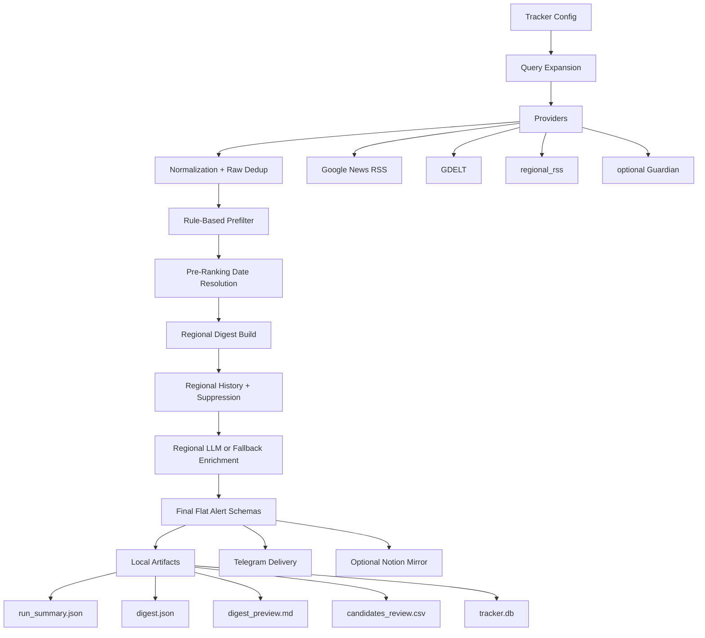

# Competitor Tracker Architecture

## Product Positioning

This repository currently contains two product branches:

- `competitor_tracker` — the new MVP for daily competitor monitoring
- `indrive_media` — the legacy pipeline that remains in the repository for continuity

This document describes the new `competitor_tracker` architecture first. The legacy pipeline is summarized briefly at the end.

## Release Path

For MVP release purposes, treat `competitor_tracker` as the only primary product path:

- repository root `main.py` defaults to `competitor_tracker`
- `competitor-tracker` is the primary packaged CLI
- `Telegram` is the primary delivery channel
- `Notion` is only an optional mirror

`indrive_media` remains in the repository as a legacy/deprecated path and should not be used as the default operational entrypoint for the MVP.

## MVP Goal

Build a low-cost daily competitor digest that:

- tracks configured competitors across selected regions
- focuses on market moves, launches, partnerships, promo/pricing, and related strategic signals
- suppresses duplicates and already-sent alerts
- delivers a compact operational digest instead of a firehose
- keeps local state in `SQLite`
- optionally mirrors final alerts into `Notion`

Non-goals for this MVP release:

- `Slack` delivery
- reels / short-video monitoring
- banner or logo recognition
- generic visual brand-detection workflows

## Design Principles

### SQLite as source of truth

`SQLite` is the operational backbone of the MVP. It stores:

- raw articles
- scored candidates
- final alerts
- run summaries
- delivery history

This keeps the tracker usable even when external integrations are unavailable.

### Cheap signals before expensive enrichment

The tracker first applies normalization, deduplication, topic detection, region detection, and scoring. This lowers the number of signals that would ever need richer enrichment.

### Config-driven monitoring

Regions, competitors, topic groups, query templates, provider list, and digest limits come from config, not hardcoded flows.

The `competitors_by_region` matrix is also the source of truth for validating allowed `competitor + region` combinations after detection, not just for generating provider queries.

### Digest-first delivery

The system is designed to decide “what is worth showing today”, not just “what was found”.

### Region-local AI budgets

Post-ranking enrichment is budgeted per macro-region, not per whole run.

- the pipeline first builds a local ranked digest for each selected region
- `llm_top_n` is applied independently inside each regional digest
- a final flat digest is then assembled from all regional results for downstream artifacts and delivery
- this prevents a high-volume region from starving other regions of LLM analysis

### Dates with layered confidence

Publication date is not taken from one source blindly. The tracker resolves one canonical date for the whole pipeline through:

- `resolved_publication_date`
- `resolved_publication_date_source`

The canonical trust priority is:

- `llm`
- `html_scraped`
- `provider`
- `undated_fallback`

This canonical pair is computed before final digest ranking. User-facing `published_date` mirrors it for dated articles, while undated fallback stays internal and is exposed outward as an empty string instead of `0001-01-01`.

### Managed carry-over

The Telegram path is not a blind retry queue. The tracker keeps a bounded carry-over model:

- alerts sent to Telegram become `delivered`
- relevant alerts that miss the Telegram top slice become `deferred`
- deferred alerts can re-enter ranking on the next Telegram run
- deferred alerts expire after `48 hours`
- stale carry-over alerts get a slight ranking penalty versus equally strong fresh alerts

### Anti-echo freshness filter

The tracker does not send obviously stale articles into the main digest by default. Freshness logic uses the canonical resolved date, not a raw provider string. Final delivery applies a `7-day` gate:

- articles newer than `7 days` can proceed normally
- clearly stale alerts are archived and marked `is_expired = True`
- alerts with no trustworthy date are treated as suspicious and filtered out by default
- stale articles can still pass if they are newly detected and materially stronger than the average alert score in the current run

This prevents noisy “echoes” from old stories while still allowing late-breaking pickups or major rewrites from large publishers to reach the team.

## System Components

## Main Modules

### Configuration

- [src/competitor_tracker/config.py](/C:/Users/shar0/Desktop/indrive_feedback/src/competitor_tracker/config.py)
- [default_config.json](/C:/Users/shar0/Desktop/indrive_feedback/src/competitor_tracker/default_config.json)
- [product_logic.py](/C:/Users/shar0/Desktop/indrive_feedback/src/competitor_tracker/product_logic.py)

Responsibilities:

- load and validate config
- freeze the canonical MVP product contract in code
- define regions and competitors
- define topic groups and keyword templates
- expand search queries for providers
- provide the strict competitor-by-region validation matrix for downstream checks
- expose the canonical allowed competitor-region pairs to downstream logic
- expose digest relevance rules and legacy topic aliases to downstream logic
- keep visual-assets monitoring explicitly out of scope and disabled by default
- allow broader `country_validation_terms` for post-LLM country safety checks
- allow global `ignored_geo_terms` so obvious non-target geographies can be dropped early
- keep runtime settings separate from domain config
- treat `GDELT` as a best-effort quota-sensitive source with local pacing, query caps, cooldown, and diagnostics rather than as a bulk high-volume retrieval backend

Default monitoring themes currently encoded in config:

- `market_expansion`
- `campaign_launches`
- `pricing_promo`
- `core_industry_terms`
- `strategic_operations`
- `performance_growth`
- `product_features_innovation`

Provider architecture note:

- `GDELT` is now intentionally throttled and capped in-product. The API path is used as a lightweight auxiliary source only.
- If product needs high-volume archive-scale or native-language keyword search, the architecture should move that workload to `Web NGrams 3.0` rather than increasing DOC API pressure.

### Providers

- [src/competitor_tracker/providers.py](/C:/Users/shar0/Desktop/indrive_feedback/src/competitor_tracker/providers.py)

Responsibilities:

- fetch low-cost public articles
- normalize provider payloads into `RawArticle`
- isolate provider-specific request logic

Current providers:

- `Google News RSS`
- `GDELT`
- `regional_rss`
- `guardian`

### Normalization and Deduplication

- [src/competitor_tracker/normalization.py](/C:/Users/shar0/Desktop/indrive_feedback/src/competitor_tracker/normalization.py)

Responsibilities:

- normalize URLs, titles, dates, and source labels
- deduplicate raw hits across providers
- keep new tracker logic independent from legacy `indrive_media`

### Analysis

- [src/competitor_tracker/analyzer.py](/C:/Users/shar0/Desktop/indrive_feedback/src/competitor_tracker/analyzer.py)
- [src/competitor_tracker/geo_policy.py](/C:/Users/shar0/Desktop/indrive_feedback/src/competitor_tracker/geo_policy.py)

Responsibilities:

- rule-based prefilter before any optional LLM usage
- preserve publication-date provenance for downstream freshness checks
- build or reuse the canonical `resolved_publication_date` before freshness-sensitive ranking
- validate `competitor + region` pairs against the config matrix before candidates move downstream
- use article-only geo text for region detection, without mixing in the originating search query
- drop articles that clearly match configured global ignored geographies unless the same article text also contains explicit target-region confirmation
- emit structured prefilter drop reasons so operations can audit why articles were rejected
- detect:
  - competitor
  - topic group
  - region
  - country hint
  - language hint
- assign baseline score and reasons
- treat detected `competitor` and `region` as pipeline-owned signals during LLM enrichment
- prevent free-form LLM overrides of `competitor` and `region` unless article evidence clearly disproves the pipeline signal
- make `candidate.competitor` authoritative over conflicting LLM output
- make `candidate.region` authoritative when the pipeline already detected a region
- validate final `country` values against `candidate.country_hint` plus region-level `country_validation_terms`
- when a competitor is valid in multiple regions, resolve region from detected geo/country evidence first; if that evidence is missing or ambiguous, keep the pipeline-detected region when available or leave region empty instead of trusting an LLM guess
- if the pipeline region is missing but validated country evidence maps cleanly to one allowed region, restore that region through config-backed logic rather than from the LLM region field itself
- map final outward-facing `africa` and `mea` region values into the single business label `Africa & MEA` for downstream delivery and analytics
- emit internal provenance flags so downstream QA can see whether final `competitor`, `region`, and `country` came from pipeline or survived LLM enrichment
- expose `resolved_publication_date` and `resolved_publication_date_source` so every downstream consumer uses the same canonical date
- produce alert-ready schema for readable delivery
- keep geo matching and ignored-geo policy isolated in a dedicated helper so region logic can evolve without bloating the analyzer orchestration

### Ranking and Suppression

- [src/competitor_tracker/digest.py](/C:/Users/shar0/Desktop/indrive_feedback/src/competitor_tracker/digest.py)

Responsibilities:

- rank by:
  - priority
  - freshness
  - deferred penalty
  - confidence
  - score
- apply final freshness gate before delivery
- suppress duplicates within one run
- suppress alerts already sent in previous runs
- suppress near-duplicate alerts from recent history
- apply top-N digest limit
- re-introduce fresh `deferred` Telegram alerts for the next run without keeping them forever

Important date behavior:

- digest freshness sorting now reads `resolved_publication_date` from prebuilt alert schemas
- articles with missing or suspicious provider dates can receive cheap HTML date extraction before ranking
- `undated_fallback` is represented internally by `date.min`, which intentionally sorts to the very end

### Storage

- [src/competitor_tracker/storage.py](/C:/Users/shar0/Desktop/indrive_feedback/src/competitor_tracker/storage.py)

Responsibilities:

- persist local JSON / CSV / Markdown artifacts
- maintain `SQLite` operational history
- keep archived stale articles available for QA through metadata and artifacts
- store canonical resolved publication-date fields in review CSV for debugging and auditability

Current `SQLite` tables:

- `articles_raw`
- `article_candidates`
- `alerts`
- `runs`
- `delivery_log`
- `rss_feed_metrics`

Archive-oriented article metadata can also include:

- `is_expired = true` for stale articles filtered out of the final digest

Delivery log statuses now have operational meaning:

- `delivered` — successfully sent to Telegram
- `deferred` — relevant but did not fit into the current Telegram top slice
- `expired` — deferred too long and no longer retried
- `dry_run` — previewed without a real delivery attempt

### Delivery and Mirror Layers

- [src/competitor_tracker/telegram_sender.py](/C:/Users/shar0/Desktop/indrive_feedback/src/competitor_tracker/telegram_sender.py)
- [src/competitor_tracker/notion_sync.py](/C:/Users/shar0/Desktop/indrive_feedback/src/competitor_tracker/notion_sync.py)
- [src/competitor_tracker/formatter.py](/C:/Users/shar0/Desktop/indrive_feedback/src/competitor_tracker/formatter.py)

Responsibilities:

- format readable alerts and daily digests
- send to Telegram with dry-run and delivery logging
- mirror final alerts to Notion when configured

Important boundary:

- `Telegram` is the main delivery layer
- `Notion` is a showcase/archive mirror
- neither replaces `SQLite` as the operational state store

## Data Flow

### 1. Query Expansion

The tracker uses config-defined:

- regions
- competitors by region
- topic groups
- keyword templates

These become provider queries.

### 2. Collection

Providers fetch raw public articles and map them into `RawArticle`.

### 3. Normalization

Raw articles are normalized and deduplicated before scoring.

At this stage, provider dates are normalized where possible. Region and country detection come from article-facing fields, not from the search query. Publication date may later be enriched from article HTML or LLM evidence, but all sources converge into one canonical resolved date.

### 4. Prefilter

The rule-based analyzer converts valid raw articles into `CandidateArticle` objects and drops weak or irrelevant items early.

At this stage, the analyzer also enforces the config truth layer for `competitor + region`. If article evidence points to a region where the detected competitor is not allowed by config, the candidate is dropped instead of being passed downstream.

For geo detection specifically, the search `query` is no longer treated as location evidence. Region and `country_hint` are derived only from article-facing text such as title, snippet/body, and source metadata.

### 5. Pre-Ranking Date Resolution

Before final ranking, the pipeline builds alert schemas early enough to compute `resolved_publication_date` in advance.

- normal provider dates can stay on the cheap path
- missing provider dates can trigger early HTML extraction
- suspicious provider dates such as stale or future dates can also trigger early HTML extraction
- all of those paths converge through the same `resolve_final_publication_date(...)` helper

This removes the old architectural skew where ranking happened before final date resolution.

### 6. History-Aware Digesting

Candidates become alerts, and the digest builder ranks them using precomputed canonical dates:

- groups candidates by selected macro-region
- ranks each region locally
- compares against history
- suppresses repeats
- trims each regional digest to the configured daily cap
- optionally merges the Telegram `deferred` pool back into the next ranking pass before regional digesting

### 7. Region-Local Enrichment

After each regional digest is ranked, the pipeline enriches alerts region by region:

- `build_delivery_alert_schemas(...)` receives only one region's digest at a time
- `llm_top_n` applies to that region only
- alerts that fall outside the regional LLM slice still receive fallback schemas
- the final result returned by `run_pipeline(...)` remains a single flat digest plus flat schema/context lists

Before final alert delivery, LLM enrichment is allowed to improve narrative fields, but it is not treated as the authority for core identity fields.
In the current implementation:

- conflicting LLM `competitor` values fall back to `candidate.competitor`
- `candidate.region` stays primary when it already exists
- if `candidate.region` is missing, region may still be restored from validated country evidence and the config truth layer
- conflicting or weak `country` values fall back to `candidate.country_hint` or become empty

The tracker keeps internal provenance markers such as:

- `competitor_source`
- `region_source`
- `country_source`
- `published_date_source`
- `resolved_publication_date_source`
- `geo_validation_fallback`

`region_source` can also become `geo_country_override` when the final region was restored from validated country evidence rather than preserved from the incoming pipeline field.

Those validation markers are visible in local review artifacts like markdown preview and CSV export, but they are intentionally kept out of the Telegram card.

### 8. Artifacts and Delivery

The run produces:

- `run_summary.json`
- `candidates.json`
- `dropped_articles.json`
- `digest.json`
- `digest_preview.md`
- optional `candidates_review.csv`
- `tracker.db`

And optionally:

- sends digest to Telegram
- mirrors alerts to Notion

Telegram delivery for the MVP is intentionally card-based:

- each alert is sent as a separate Telegram message
- the outward-facing Telegram card stays in Russian
- the card structure is fixed and concise, separate from richer local review artifacts

Telegram-specific carry-over only applies to the delivery path. Local-only runs still produce artifacts and history, but they do not keep building an endless retry queue.
Stale alerts that fail the final `7-day` gate do not reach Telegram or the main digest, but they remain visible in archive artifacts and `SQLite` metadata for auditability.

Downstream consumers now follow the canonical date contract:

- Telegram receives user-facing `published_date`, which stays empty for undated fallback cases
- Telegram applies its own `telegram_top_n` delivery cap, separate from the regional `llm_top_n` enrichment cap
- CSV review artifacts include both outward `published_date` and technical `resolved_publication_date`
- Notion reads the already computed resolved date from the final schema and only falls back to the resolver if that field is unexpectedly absent

## Low-Cost Daily Digest Strategy

The MVP is intentionally optimized for low-cost daily operation:

- no paid ingestion dependency is required to get started
- most filtering happens before any richer analysis step
- `SQLite` keeps history local and cheap
- digest cap prevents operational overload
- ranking, stale gate, CSV, and Notion all use the same canonical resolved publication date
- `competitor` and `region` remain pipeline-owned fields; the LLM may enrich explanation, but it should not freely rewrite these identifiers
- a `7-day` anti-echo filter removes stale low-value content from delivery
- strong newly detected stale signals can still pass via override instead of being silently lost
- deferred carry-over prevents relevant alerts from disappearing while still avoiding a Telegram firehose
- markdown and CSV artifacts make manual QA simple during live trial periods

## Reliability Strategy

The new branch is protected by:

- unit tests for key modules
- integration-style tests for:
  - full dry-run with mocked providers
  - duplicate suppression across runs
  - already-sent suppression
  - digest cap behavior
  - provider partial failure
  - optional Notion behavior

This makes the refactor safer while the product branch is still evolving.

## Automation Path

The competitor tracker has its own GitHub Actions workflow:

- [competitor-tracker.yml](/C:/Users/shar0/Desktop/indrive_feedback/.github/workflows/competitor-tracker.yml)

It supports:

- scheduled daily execution
- manual dispatch
- dry-run mode
- artifact upload

The original CI workflow remains separate.

## Legacy Pipeline

The legacy branch is still present in:

- [src/indrive_media/](/C:/Users/shar0/Desktop/indrive_feedback/src/indrive_media)

Its responsibilities are different:

- inDrive mention monitoring
- legacy export/reporting flow
- separate CLI and legacy integration path

It should not be treated as the architecture of the new competitor tracker MVP, and it is intentionally excluded from the default release path.
